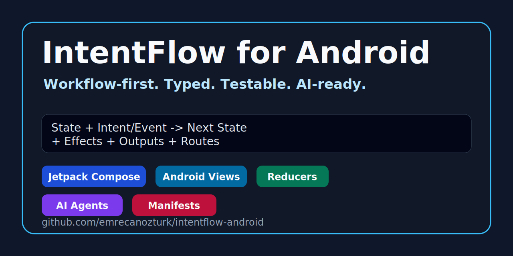
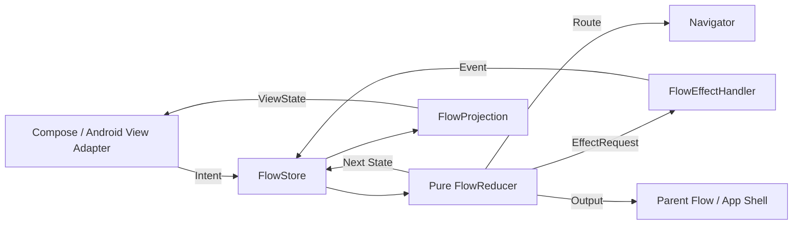

# IntentFlow for Android

[](https://github.com/emrecanozturk/intentflow-android/actions/workflows/ci.yml)
[](https://github.com/emrecanozturk/intentflow-android/actions/workflows/docs.yml)
[](https://github.com/emrecanozturk/intentflow-android/actions/workflows/codeql.yml)
[](https://github.com/emrecanozturk/intentflow-android/releases)
[](LICENSE)




IntentFlow is a workflow-first, AI-ready architecture for Android and Kotlin apps. It makes product behavior explicit, typed, testable, and safer for coding agents to extend.

It treats a feature as executable behavior:

```text
State + Intent/Event -> Next State + Effects + Outputs + Routes
```

The goal is not to invent another folder naming convention. MVC, MVP, MVVM, Clean Architecture, Redux, MVI, Orbit, Mavericks, Decompose, and workflow-style architectures all solved real problems. IntentFlow starts where those patterns often become unclear: async workflows, side effects, cancellation, navigation, recovery, observability, and AI-assisted code generation.

## Try It In 60 Seconds

```bash
git clone https://github.com/emrecanozturk/intentflow-android.git
cd intentflow-android
./gradlew test
./gradlew :intentflow-generator:run --args="validate .intentflow/login.intentflow.yaml"
./gradlew :intentflow-generator:run --args="ai-context .intentflow/login.intentflow.yaml --tool codex"
```

Generate a feature:

```bash
./gradlew :intentflow-generator:run --args="feature Checkout --mode ai --ui compose --output /tmp/intentflow-demo"
```

## Use It When

- a ViewModel is becoming a workflow engine
- async retry, cancellation, and recovery paths are hard to test
- navigation decisions are scattered across screens
- parent communication is hidden in callbacks
- AI-generated code looks plausible but drifts from architecture rules
- you want one contract that humans and coding agents can both follow

## Two Flavors

| Mode | Use When | Includes |
|---|---|---|
| IntentFlow Core | You want a lightweight architecture humans can use without a framework-heavy commitment. | State, Intent, Event, Effect, Output, Route, pure reducer, effect handler, store, projection, tests. |
| IntentFlow AI | You want AI-assisted generation and stricter guardrails. | Everything in Core plus `.intentflow.yaml`, invariants, acceptance traces, Cursor rules, Copilot instructions, generator support, validation. |

Core is the architecture.

AI mode is the architecture plus a machine-readable contract so AI tools know what they are allowed to change.

## AI Agent Support

IntentFlow includes provider-specific instruction surfaces so AI tools can work from the same architecture contract:

| Tool | Files |
|---|---|
| Codex | `AGENTS.md`, `.ai/agent-context.md` |
| Claude Code | `CLAUDE.md`, `.claude/rules/*.md` |
| Gemini CLI | `GEMINI.md`, `.geminiignore` |
| GitHub Copilot | `.github/copilot-instructions.md`, `.github/instructions/*.instructions.md` |
| Cursor | `.cursor/rules/intentflow.mdc` |

Generate compact context for an agent instead of loading the whole repository:

```bash
./gradlew :intentflow-generator:run --args="ai-context .intentflow/login.intentflow.yaml --tool codex"
```

See [AI Agent Usage](docs/ai/agent-usage.md) and [Context Budgeting](docs/ai/context-budgeting.md).

## What It Completes

| Existing Pattern | What It Gets Right | What IntentFlow Adds |
|---|---|---|
| MVC / MVP | Simple responsibility split. | Prevents controllers and presenters from becoming implicit workflow engines. |
| MVVM | Good UI state ownership and Android ecosystem fit. | Stops ViewModels from absorbing navigation, retry, cancellation, analytics, and permission workflows. |
| Clean Architecture | Strong dependency direction. | Keeps dependency discipline while avoiding unnecessary use-case/repository ceremony for every screen transition. |
| Redux / MVI / UDF | State and events are visible and testable. | Adds typed effects, routes, outputs, cancellation IDs, and Android adapter guidance. |
| Orbit / Mavericks | Practical state-container patterns. | Adds a smaller platform-neutral core plus a manifest for AI generation and review. |
| Decompose / RIB-style flows | Good composition for large apps. | Keeps workflow thinking but makes adoption smaller for normal feature teams. |

## Architecture Shape



Every feature starts with its own contract. The `Login` types below are only an example shape; real apps define these types per feature, such as `CheckoutState`, `UploadIntent`, or `PermissionEvent`.

```kotlin
sealed interface LoginState {
    data object Idle : LoginState
    data class Validating(val email: String) : LoginState
    data object RequestingToken : LoginState
    data object WaitingForTwoFactor : LoginState
    data class Failed(val message: String) : LoginState
    data class Authenticated(val userId: String) : LoginState
}

sealed interface LoginIntent {
    data class Submit(val email: String, val password: String) : LoginIntent
    data class SubmitTwoFactor(val code: String) : LoginIntent
    data object Cancel : LoginIntent
}

sealed interface LoginEvent {
    data object CredentialsValid : LoginEvent
    data object TokenRequiresTwoFactor : LoginEvent
    data class TokenReceived(val userId: String) : LoginEvent
    data class TokenFailed(val message: String) : LoginEvent
}
```

Then that feature's reducer owns behavior:

```kotlin
class LoginFlow :
    FlowReducer<LoginState, LoginIntent, LoginEvent, LoginEffect, LoginOutput, LoginRoute> {
    override fun reduce(
        state: LoginState,
        signal: FlowSignal<LoginIntent, LoginEvent>
    ): Next<LoginState, LoginEffect, LoginOutput, LoginRoute> =
        when (signal) {
            is FlowSignal.IntentSignal -> when (val intent = signal.intent) {
                is LoginIntent.Submit ->
                    Next.state<LoginState, LoginEffect, LoginOutput, LoginRoute>(
                        LoginState.Validating(intent.email)
                    ).effect(
                        LoginEffect.Validate(intent.email, intent.password),
                        id = EffectId("login.validate"),
                        policy = EffectPolicy.CancelInFlight
                    )
                else -> Next.state(state)
            }
            is FlowSignal.EventSignal -> when (val event = signal.event) {
                is LoginEvent.TokenReceived ->
                    Next.state<LoginState, LoginEffect, LoginOutput, LoginRoute>(
                        LoginState.Authenticated(event.userId)
                    ).output(LoginOutput.Completed(event.userId))
                else -> Next.state(state)
            }
        }
}
```

## Installation

IntentFlow Android is currently published as a source-first Gradle project. Add it as a Git submodule, subtree, or composite build until a package artifact is published:

```kotlin
// settings.gradle.kts
includeBuild("../intentflow-android")
```

Then depend on the modules:

```kotlin
dependencies {
    implementation("dev.intentflow:intentflow-core")
    implementation("dev.intentflow:intentflow-ai")
}
```

## Generate a Feature

```bash
./gradlew :intentflow-generator:run --args="feature Checkout --mode ai --ui compose --output ./app/src/main/kotlin/features"
```

Generated files:

```text
Checkout/
  CheckoutContract.kt
  CheckoutFlow.kt
  CheckoutEffects.kt
  CheckoutProjection.kt
  CheckoutAdapter.kt
  CheckoutFlowTest.kt
  Checkout.intentflow.yaml
  Checkout.ai-context.md
```

## Examples

- [Compose adapter example](examples/compose-example)
- [ViewModel adapter example](examples/viewmodel-example)
- [MVVM migration example](examples/migration-mvvm)

The examples intentionally model workflows that ViewModels often absorb: progress, retry, cancellation, routing, and output communication.

## Launch Resources

- [GitHub Wiki](https://github.com/emrecanozturk/intentflow-android/wiki)
- [Quick Start](docs/adoption/quick-start.md)
- [FAQ](docs/faq.md)
- [IntentFlow 0.1.0 Release Notes](docs/release/0.1.0.md)

## Project Status

This is an experimental 0.1 architecture proposal. The public promise is intentionally small:

- make product behavior explicit
- keep effects outside reducers
- keep UI as an adapter
- keep routes and outputs typed
- make tests describe workflows
- make AI generation constrained by a manifest

Architecture is not folder structure. Architecture is executable product behavior.
